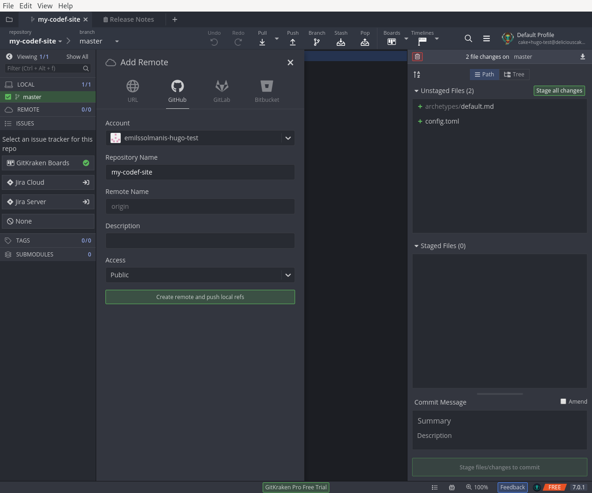
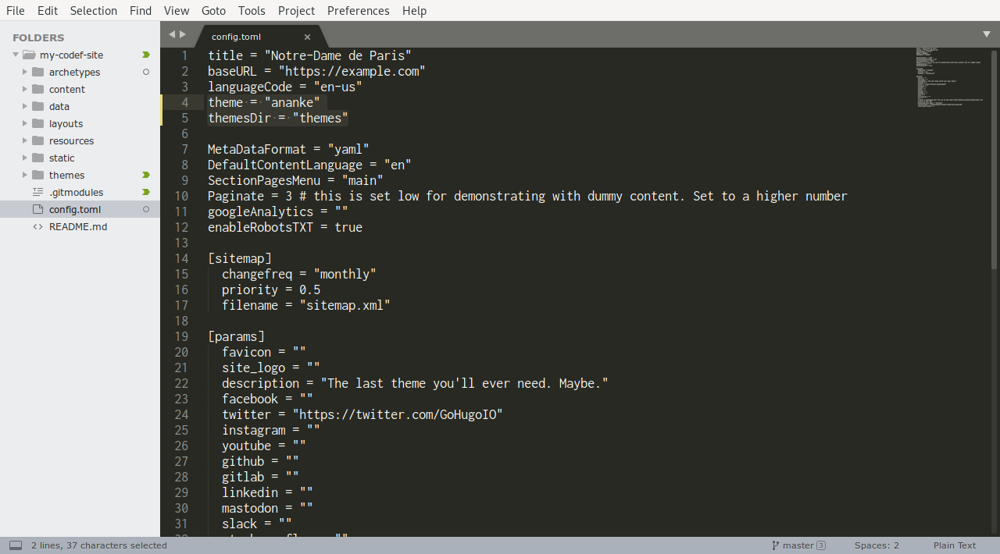

# Creating your first website

## Windows
Please create a folder named `Sites` in `C:\Hugo`, i.e., when you're done, you should have a structure like `C: > Hugo > Sites`. There will be 2 folders in `C:\Hugo` named `Sites` and `bin`.

Navigate to the newly created `Sites` folder. Then click the line with the folder list, it should turn editable. 


Type in `powershell` and press Enter. 


You should see a terminal window appear.


## macOS
Please create a folder named `Sites` in your home directory. You can use Finder to do this.

Open a Terminal app. You can do this via your launcher, e.g., Cmd+Space, then type in `Terminal` and press Enter.

Type in `cd ~/Sites`

## Generating a basic site
On either platform, in your terminal type in 

```
hugo new site my-codef-site
```

It should print some information, but a basic site is now generated.

# Sending the site to Github

## GitKraken
Open your GitKraken.

It'll ask some irrelevant info, like picking an avatar, or your name. Fill in whatever you want, they don't have to be your real details.

Say no to the paid version or trial of the Pro version, the free version is actually free.

You should be greeted with the home screen.


Pick `Start a local repo`


Select the `Init` tab. Fill in

- `my-codef-site` for `Name`
- find your `Sites` folder for the `Initialize in`


Click `Create Repository`.

You should see a window with some bubbles saying `master` and `Initial commit`.


This should open a window with some blue bubbles, saying `master` and `Initial commit`.

We now want to replicate this to Github. To do this, we 

- find the section on the left that says `Remote`
- click the green `+` sign


Choose `Github`. Leave all values as is and just click `Create remote and push local refs`



In a short while it should show a success message


# Adding a basic theme
For Hugo to display any content for your site, we need to pick a "theme". A theme determines _how_ Hugo displays your content.

We'll explore themes in more detail later, but for now let's add the _Ananke_ theme to our site so we can see it.

In GitKraken, find the `Submodules` section on the left side, and click the `+` button.


Input `https://github.com/budparr/gohugo-theme-ananke.git` for `Remote URL` and `themes/ananke` for `Name/Path`.


Click `Add submodule`, you'll see some progress animations, and ultimately a success message.


Then navigate to your site's folder, go to `theme > ananke > exampleSite`, and copy the file named `config.toml` to your site's folder.

Finally, start Sublime. Pick `File > Open Folder`, and find the folder your site is in (`C:\Hugo\Sites\my-codef-site` for Windows and `Sites/my-codef-site` for Mac).

You should see Sublime open up a folder structure, listing all the files.


Find and open the `config.toml` file you just created.

We're interested in changing 2 lines here.


- we need to change `theme = "gohugo-theme-ananke"` to `theme = "ananke"`
- and `themesDir = "../.."` to `themesDir = "themes"`



Save the file.

# Seeing your website
Switch back to your terminal window.

Enter

```
cd my-codef-site
```

followed by

```
hugo server -D
```

You should now have a [running website](http://localhost:1313).

## It's responsive
TODO

# Further reading
Everything past this point is optional, and these are just some topics for further exploration.

## Sublime plugins
Sublime supports a wide, wide array of plugins. There is one for Hugo as well, feel free to [install it](https://github.com/akmittal/Hugofy-sublime) and play around.

## Git tutorial
Github has an **extensive** set of guides on what Git is, and how to use it. A good starting point that covers the basics is their [Git handbook](https://guides.github.com/introduction/git-handbook/)

# Extra work
