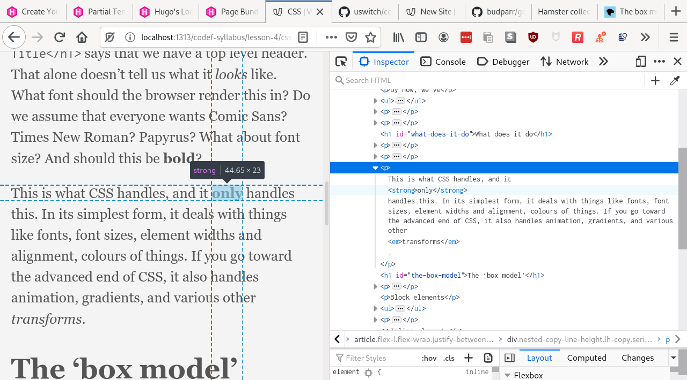

By now, we've 

- made a basic site
- made some content for it
- published it to the internets at large
- learned about templates

In this final lesson we'll talk about how you can change the _look_ of your site.

Modern web pages are _styled_ by something called _CSS_, or _Cascading Style Sheets_. We won't cover the "cascading" aspect here, but we'll give you a basic crash course in styling your website.

# What does it do
HTML defines the _structure_ of your documents. I.e., it talks about _what_ a thing is. CSS bolts on top of HTML and tells the browser what each thing _looks_ like.

For example, an HTML fragment like `<h1>My Title</h1>` says that we have a top level header. That alone doesn't tell us what it _looks_ like. What font should the browser render this in? Do we assume that everyone wants Comic Sans? Times New Roman? Papyrus? What about font size? And should this be **bold**?

This is what CSS handles, and it **only** handles this. In its simplest form, it deals with things like fonts, font sizes, element widths and alignment, colours of things. If you go toward the advanced end of CSS, it also handles animation, gradients, and various other _transforms_.

# The 'box model'
Fundamentally CSS treats HTML elements in 2 different ways: block and inline.

Block elements

- have a width and height
- fill the maximum alloted space
- break onto a new line

Examples of these are paragraphs `<p>`, headers `<h1>`.

Inline elements

- have no height or width
- will only fill as much space as the contents need
- will not break onto a new line

Examples of these are links `<a>`, the _italic_ tag `<em>`, the **bold** tag `<strong>`.

We can observe this "box model" in action using tools built into every browser. If we right click somewhere on a paragraph of the course materials, and pick _Inspect element_ (FF) or _Inspect_ (Chrome), we'll see a panel come up with a bunch of "developer tools".

If you move your mouse over individual HTML elements in the opened tool, you'll see the respective _boxes_ highlighted in your browser.



This is relevant if you want to, e.g., split your content into columns. To achieve that, you'd need 2 "boxes", each taking up about 50% of the screen width.

# How CSS and HTML tie together
CSS itself consists of 2 parts, _selectors_ and _rules_.

_Selectors_ pick **what** the bit of CSS applies to. Some basic selectors are `p` to select all paragraph elements, e.g., if you wanted to set font-size for all your paragraphs, or we can use something called _classes_. 

_Classes_ are just names of things we put in our HTML. They're extremely common, and they were present in all the templates we've seen so far. If you open any of them, you'll see something like `<h1 class="f3 near-black">...</h1>`.
This specifies an `h1` HTML element with classes `f3` and `near-black`, the meaning of which we'll cover shortly. 

To select a class you prefix its name with a dot, so the selector for class `f3` would be `.f3`.

_Rules_ tell us what to do with the selected elements. Rules look like `font-size: 12px`. There are **lots** of properties you can tweak.

Putting it together, a basic snippet of CSS looks like

```css
p {
  font-size: 13px;
}

.black {
  color: black;
}
```

In the real world, however, you often don't need raw CSS like that. We'll look at what our theme, Ananke, does for us to make life easier.
